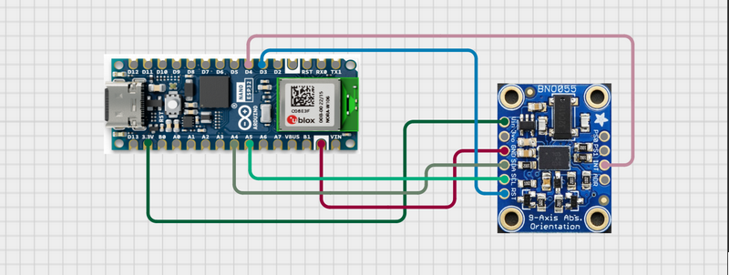
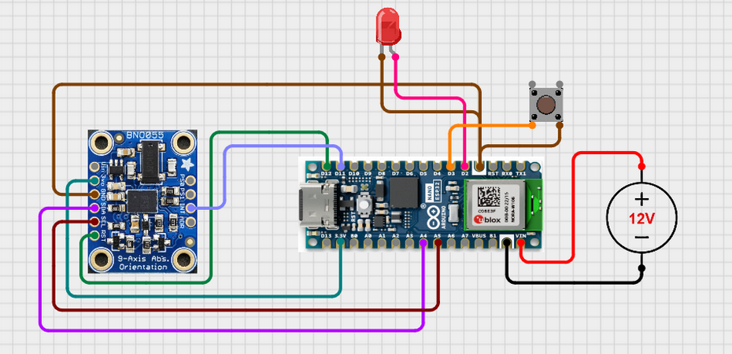
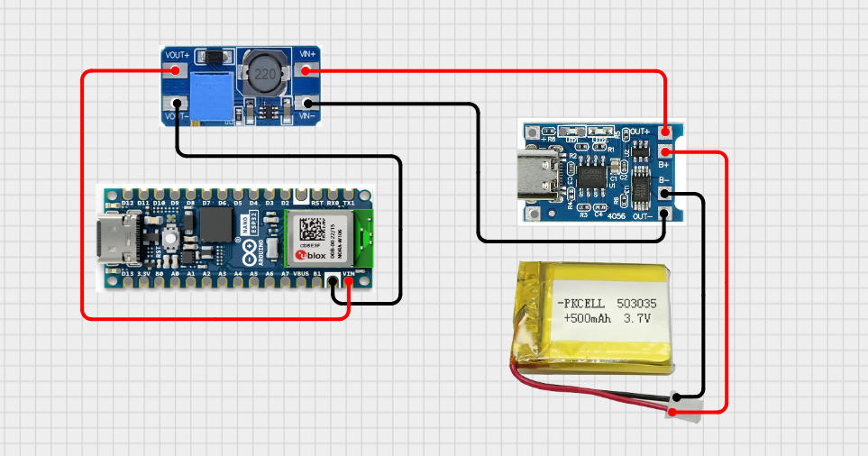

# Introducción

Este proyecto busca el diseño y desarrollo de un sistema inteligente de detección de
caídas. Consistiendo del microcontrolador Arduino Nano ESP32 integrado con el
sensor BNO-055, unido a una aplicación móvil para facilitar la comunicación en caso de
emergencia y el monitoreo en tiempo real. El público principal son adultos en la tercera
edad que viven solos y tienen mayor riesgo de sufrir caídas peligrosas. El producto
también está diseñado para cualquier persona que pueda sufrir riesgo de caídas en
ambientes peligrosos.

Las caídas son una de las mayores causas de lesión y hospitalización entre personas
mayores, comúnmente resultando en daños físicos y psicológicos graves. Aun con la
existencia de varios sistemas de detección de caídas, siguen habiendo muchos
problemas a solucionar para conseguir un rendimiento preciso en la aplicación en el
mundo real, y que sea aceptado por los usuarios, particularmente en el diseño fácil y
entendible, con buena conectividad para hacerlo robusto y que sea cómodo de llevar y
usar. Usando el Arduino Nano ESP32, el cual es compacto y tiene funciones WIFI,
unido con el sensor BNO-055 con un sensor de 9 ejes, el dispositivo será capaz de
monitorear y analizar continuamente los patrones de movimiento para detectar caídas
de una manera responsiva y eficiente.

Una de las principales innovaciones del proyecto es su arquitectura de comunicación.
La aplicación móvil se conecta al Arduino usando una red WIFI, así creando una
conexión más robusta con mayor capacidad de transmisión de datos dentro del entorno
de una vivienda, donde queremos que haya una conexión robusta para cubrir todo el
perímetro, donde una conexión Bluetooth sufre más. Así todo, una conexión bluetooth
también será disponible para momentos de movilidad fuera de la vivienda, donde una
conexión WIFI no esté disponible, y el dispositivo móvil esté siempre cerca del usuario.
Este modo dual asegura que los usuarios se beneficien de la flexibilidad, rendimiento
consistente y mínimas interrupciones. En el momento en el que se detecte una caída,
el Arduino mandará una alerta a la aplicación móvil, la cual de manera instantánea
contactará con los contactos de emergencia, así facilitando una intervención rápida en
caso de peligro, mientras se evita el peligro de notificaciones perdidas.

Este proyecto pone el mismo énfasis en privacidad y en usabilidad, dando la capacidad
a los usuarios de configurar y administrar el dispositivo sin pasos técnicos para hacerlo
lo más fácil para todos los usuarios. El objetivo final es crear un dispositivo que sea
fácilmente portable, fácil de usar y sobre todo que sea fiable, para que esté siempre
disponible para los usuarios y que facilite la vida de quien lo use.

# Estudio Bibliográfico

1. El uso y la importancia de los dispositivos de detección de caídas
• Estudios y estadísticas sobre caídas, especialmente para adultos mayores.
• Consecuencias médicas, psicológicas y sociales de las caídas.
• Por qué es importante la detección automatizada de caídas: la intervención
oportuna reduce los riesgos y mejora la calidad de vida.

2. Aspectos relevantes adicionales
• Preocupaciones de privacidad y seguridad
• Garantizar la protección de los datos de los usuarios y las comunicaciones
seguras, especialmente en dispositivos relacionados con la salud.
• Validación en el mundo real y aceptación del usuario
• Estudios que informan la aceptación, adherencia y retroalimentación de los
adultos mayores sobre los dispositivos de detección de caídas.
• Integración de respuesta a emergencias
• Protocolos y sistemas para notificaciones automáticas a cuidadores, proveedores
de atención médica o servicios de emergencia.

3. Soluciones existentes para detección de caídas:
• Inspeccione los dispositivos comerciales y académicos actuales.
• Analice las arquitecturas que utilizan conectividad Bluetooth frente a WiFi,
destacando cualquier dispositivo que aproveche WiFi para la confiabilidad en el
hogar.
• Comparación de dispositivos portátiles, soluciones centradas en teléfonos
inteligentes y enfoques basados en sensores ambientales.
Puntos clave a cubrir:
• Rendimiento y validación en el mundo real
• Opciones de conectividad y su impacto
• Integración con aplicaciones móviles

4. Tecnologías utilizadas en la detección de caídas
• Sensores: acelerómetros, giroscopios, magnetómetros (como BNO-055), cámaras,
sensores de presión.
• Microcontroladores y módulos de comunicación (Arduino Nano ESP32, Bluetooth,
WiFi).
• Algoritmos y aprendizaje automático para la detección de caídas.
• Integración de IoT y nube para la gestión de datos y alertas de emergencia.

5. Metodologia que tencologias propones tu, la architectura de ellas

6. diseño del backend

7. Diseño de interfaz de usuario para usuarios mayores
• Mejores prácticas para interfaces de usuario simples e intuitivas adaptadas a
usuarios mayores.
• Consideraciones de accesibilidad: tamaño de fuente, contraste de color, modelos
de interacción.
• Mecanismos de retroalimentación y alerta (audio, vibración, señales visuales).
• Estudios de usabilidad en aplicaciones móviles para alertas de emergencia.

8. Validacion con sujetos

https://www.sciencedirect.com/science/article/pii/S2666165925001450
https://www.sciencedirect.com/science/article/pii/S1525861024007527
https://www.sciencedirect.com/science/article/pii/S2949715924000283
https://www.eleken.co/blog-posts/examples-of-ux-design-for-seniors
https://www.cdc.gov/falls/data-research/index.html
https://www.ncoa.org/product-resources/medical-alert-systems/best-medical-alert-systems-with-fall-detection/
https://www.gigabyte.com/Solutions/fall-detection

# CONEXIÓN ENTRE ARDUINO Y SENSOR

| BNO-055 (PIN) | Arduino Nano ESP32 (PIN) | Notas                                   |
| ------------- | ------------------------ | --------------------------------------- |
| VIN           | 3.3V                     | Power input                             |
| GND           | GND                      | Toma de tierra                          |
| SDA           | A4                       | I2C Data line                           |
| SCL           | A5                       | I2C Clock line                          |
| RST           | D3 (Opcional)            | Reset del sensor                        |
| INT           | D4 (Opcional)            | Pin de interrupción, señales al arduino |

### VIN (Power Input)
• Role: Tomo de corriente para el sensor

• Función: El Pin VIN tiene que estar conectado al pin de 3.3V (o 5V, depende del
modelo específico) del Arduino.

### GND (Ground)
• Role: Toma de tierra, para referencia eléctrica para ambos componentes.

• Función: El pin de GND garantiza que ambos tengan la misma referencia de voltaje.
Necesario para garantizar la comunicación y que no haya diferencias de voltaje que
puedan dañar los componentes.

### SDA (Serial Data Line)
• Role: Línea de transmisión de datos entre el sensor y el Arduino.

• Función: El pin SDA es parte del protocolo I2C que se usa para enviar los datos entre ambos componentes. Es bidireccional. Se conecta a un pin analógico del Arduino, ya que puede tomar muchos valores (no sólo binario como los digitales).

### SCL (Serial Clock Line)
• Role: Da timing para la transmisión de datos

• Función: El pin SCL es la línea de reloj para el protocolo I2C. El Arduino manda una señal en intervalos regulares, coordinando cuando se tiene que leer o escribir los datos que pasan por la línea de SDA.

### RST (Reset; opcional)
• Role: Permite un reseteo del hardware manual

• Función: Cuando se pone en low, se reseteará el BNO-055, reiniciando su operación.
Puede ser útil en momentos en los que se quiera que se recupere de algún error o
problema desde el Arduino. Su conexión no es necesaria, pero si puede ser útil.

## ELECCIÓN DE COMPONENTES

Para el microcontrolador he elegido el Arduino Nano ESP32. Este microcontrolador de Arduino
ofrece muchas funcionalidades aun siendo muy compacto, por lo que lo hace ideal para esta
aplicación. Viene con chip para la comunicación WiFi y Bluetooth, las cuales serán necesarias
para que tenga comunicación con la aplicación móvil. También es muy importante su form-
factor ya que, al ser un dispositivo de un tamaño tan reducido, al unirlo con el resto de los
componentes necesarios, seguirá siendo de un tamaño razonable para la comodidad de los
usuarios. El Arduino Nano ESP32 también dispone de una capacidad de cómputo más que
suficiente para su función en este proyecto.

Para el sensor he elegido el BNO-055 con 9 DOF. Este sensor combina acelerómetro,
giroscopio y magnetómetro y ofrece datos de orientación (Quaterion, ángulos de Euler) y
vectores de aceleración lineal con un procesamiento de fusión en el propio dispositivo. Esto
hace que, aun con su pequeño tamaño, sea increíblemente preciso si usado correctamente.
También contiene un procesador muy potente para la aplicación que se va a desarrollar en este
proyecto. Su implementación justo con el Arduino Nano ESP32 también es bastante simple ya
que usa el protocolo de comunicaciones I2C, el cual lo hace muy flexible y fácil. Es importante
mencionar que este sensor cuenta con numerosas librerías que harán el desarrollo de proyecto más fácil.

----
### Union con otros componentes

| ARDUINO (PIN) | Componentes              |
| ------------- | ------------------------ |
| VIN           | Bateria +                |
| GND           | Bateria -                |
| GND           | LED corto                |
| SCL           | LED largo                |
| D3            | Boton leg 1              |
| GND           | Boton leg 2              |

---

Librerías iniciales: Adafruit BNO055 y Adafruit Unified Sensor

Código de ejemplo para el testeo de la unión entre el Arduino y el sensor
(https://learn.adafruit.com/adafruit-bno055-absolute-orientation-sensor/arduino-code)

Ejemplo de código en el repositorio del proyecto, hechos con la ayuda de este repositorio
(https://github.com/arduino-libraries/BNO055?tab=readme-ov-file).

---

### Circuito de carga 

**TC4056A + 3.7 Li-Po Battery 500 mAh + Voltage Booster**

Union de el modulo de carga y un step-up voltage booster.

- La bateria elegida es una Li-Po de 3.7V 500mAh.
- El modulo de carga es el TP4056 usb-c.
- El voltage booster es uno generico a 5V (DM13).

La conexion entre los componentes es la vista en la imagen.

| DEL PIN:       | AL PIN:                 |
| -------------- | ----------------------- |
| BAT+           | TP4056 BAT+             |
| BAT-           | TP4056 BAT-             |
| TP4056 OUT+    | BOOST Vin+              |
| TP4056 OUT-    | BOOST Vin-              |
| BOOST Vout+    | ARDUINO Vin             |
| BOOST Vout-    | ARDUINO GND             |

Esto convierte la carga de la bateria de 3.7V a una carga de 5V que puede encender el arduino desde su pin VIN.